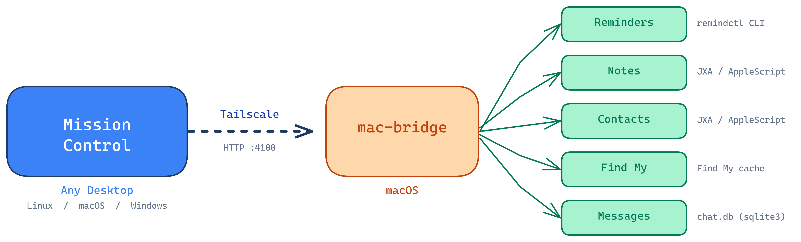

# mac-bridge

A lightweight REST bridge that exposes macOS-only services over HTTP — built for [Mission Control](https://github.com/Josue7211/mission-control).

Mission Control is a cross-platform desktop app (Linux, macOS, Windows) that integrates iMessage, AI chat, task management, and more. Since Apple services like Reminders, Notes, Contacts, and Find My only have APIs on macOS, this bridge runs on a Mac and makes them available to Mission Control over the network via [Tailscale](https://tailscale.com).

<p align="center"></p>

## Services

| Endpoint | Source | Description |
|---|---|---|
| `GET /reminders` | [remindctl](https://github.com/keith/reminders-cli) | List, create, complete, delete Apple Reminders |
| `GET /notes` | JXA (AppleScript) | Search, list, read, create Apple Notes |
| `GET /contacts` | JXA (AppleScript) | Search contacts, get details, serve contact photos |
| `GET /findmy/devices` | Find My cache | List devices with location, battery, model |
| `POST /messages/mark-read` | sqlite3 on chat.db | Mark iMessage conversations as read |
| `GET /messages/attachment-raw` | Messages attachments dir | Serve raw attachments with HEIC→PNG conversion |

## Setup

### 1. Prerequisites

- **macOS** (uses AppleScript, JXA, `sips`, and macOS-specific file paths)
- **Node.js 18+** — install via [Homebrew](https://brew.sh): `brew install node`
- **[Tailscale](https://tailscale.com)** — for secure remote access from your desktop
- **[remindctl](https://github.com/keith/reminders-cli)** — for Reminders support: `brew install keith/formulae/reminders-cli`

#### macOS permissions

The bridge needs access to your data. Go to **System Settings → Privacy & Security** and grant your terminal (or the node process) access to:

| Permission | Required for |
|---|---|
| **Full Disk Access** | Messages (chat.db), attachments |
| **Contacts** | Contact search and photos |
| **Reminders** | Apple Reminders via remindctl |

> macOS will prompt you the first time each service is accessed. Click "Allow" when asked.

Find My requires the **Find My** app to be open (or recently synced) — the bridge reads its local cache.

### 2. Clone and install

```bash
git clone https://github.com/Josue7211/mac-bridge.git
cd mac-bridge
npm install
```

### 3. Generate an API key

The API key prevents unauthorized access to your Mac's data. Generate a random one:

```bash
openssl rand -hex 32
```

Copy the output — you'll need it in two places:
1. The bridge config (`.env` on your Mac)
2. Mission Control (Settings → Connections → mac-bridge API key)

### 4. Configure

```bash
cp .env.example .env
```

Edit `.env` with your generated key:

```
BRIDGE_PORT=4100
BRIDGE_API_KEY=paste-your-generated-key-here
```

### 5. Test it works

```bash
npm start
```

In another terminal, verify:

```bash
curl -H "X-API-Key: YOUR_KEY" http://localhost:4100/health
# → {"ok":true,"services":["reminders","notes","contacts","findmy"]}

curl -H "X-API-Key: YOUR_KEY" http://localhost:4100/reminders
# → your Apple Reminders as JSON
```

If that works, stop the server (`Ctrl+C`) and install it as a background service.

### 6. Install as a background service

```bash
./install.sh
```

This creates a **launchd** service that:
- Starts automatically when you log in
- Restarts automatically if it crashes
- Runs silently in the background (no terminal window needed)
- Logs to `/tmp/mac-bridge.log`

#### Managing the service

```bash
# Check if running
launchctl list | grep mac-bridge

# View logs
tail -f /tmp/mac-bridge.log

# Stop
launchctl unload ~/Library/LaunchAgents/com.mac-bridge.plist

# Start
launchctl load ~/Library/LaunchAgents/com.mac-bridge.plist

# Reinstall (after changing .env or updating code)
./install.sh
```

### 7. Connect Mission Control

In Mission Control on your desktop, go to **Settings → Connections** and set:

- **mac-bridge URL:** `http://<your-mac-tailscale-ip>:4100`
- **mac-bridge API key:** the same key you generated in step 3

Find your Mac's Tailscale IP with:

```bash
tailscale ip -4    # on your Mac
```

## API

All endpoints return JSON. Every request must include the API key:
- Header: `X-API-Key: <key>`, or
- Query param: `?api_key=<key>`

### Health

```
GET    /health                 # → { ok: true, services: [...] }
```

### Reminders

```
GET    /reminders              # list all (or ?filter=incomplete)
GET    /reminders/lists        # list all reminder lists
GET    /reminders/lists/:name  # reminders in a specific list
POST   /reminders              # create: { title, list?, due? }
POST   /reminders/complete     # complete: { ids: [...] }
DELETE /reminders/:id          # delete a reminder
```

### Notes

```
GET    /notes                  # list notes (?search=, ?folder=, ?limit=50)
GET    /notes/folders          # list folders with note counts
GET    /notes/:id              # full note content (plaintext + html)
POST   /notes                  # create: { title, body?, folder? }
```

### Contacts

```
GET    /contacts               # list contacts (?search=, ?limit=30)
GET    /contacts/photo         # contact photo (?address=+15551234567)
GET    /contacts/:id           # full contact details
```

### Find My

```
GET    /findmy/devices         # all devices with location + battery
```

### Messages

```
POST   /messages/mark-read         # mark as read: { chatGuid }
GET    /messages/attachment-raw     # serve attachment: ?guid=&name=
```

## Security

- **Always set `BRIDGE_API_KEY`** — without it, anyone who can reach the server can read your contacts, notes, reminders, and device locations
- The server binds to `0.0.0.0` (all interfaces) so it's reachable over Tailscale. If your Mac is on a shared/public network, consider binding to your Tailscale IP only, or use a firewall to block port 4100 on non-Tailscale interfaces
- All user inputs in JXA/AppleScript are sanitized via `safeJxaString()` to prevent injection
- `chatGuid` is validated against a strict regex before use in SQL
- Attachment file serving is path-restricted to `~/Library/Messages/Attachments/`
- The bridge has **no internet access requirements** — it only talks to local macOS services and responds to incoming HTTP requests

## Troubleshooting

| Problem | Fix |
|---|---|
| `remindctl: command not found` | `brew install keith/formulae/reminders-cli` |
| Reminders returns empty | Grant Reminders permission in System Settings → Privacy |
| Notes/Contacts returns error | Grant permission when macOS prompts, or add manually in Privacy settings |
| Find My returns "cache not available" | Open the Find My app on your Mac and wait for it to sync |
| Messages mark-read fails | Grant Full Disk Access to your terminal in System Settings → Privacy |
| Bridge not reachable from desktop | Check Tailscale is running on both machines: `tailscale status` |
| Service won't start after install | Check logs: `cat /tmp/mac-bridge.log` and verify `node` path: `which node` |

## License

MIT
